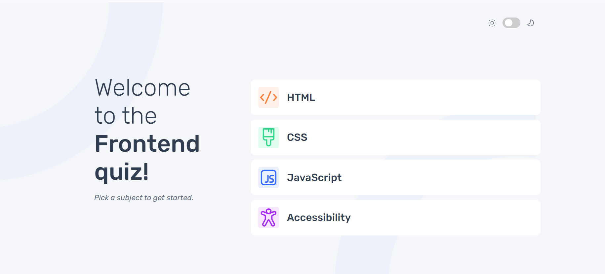

# Frontend Mentor - Frontend quiz app solution

This is a solution to the [Frontend quiz app challenge on Frontend Mentor](https://www.frontendmentor.io/challenges/frontend-quiz-app-BE7xkzXQnU). Frontend Mentor challenges help you improve your coding skills by building realistic projects. 

## Table of contents

- [Overview](#overview)
  - [Screenshot](#screenshot)
  - [Links](#links)
- [My process](#my-process)
  - [Built with](#built-with)
  - [What I learned](#what-i-learned)
  - [Continued development](#continued-development)
  - [Useful resources](#useful-resources)
- [Author](#author)
- [Acknowledgments](#acknowledgments)

**Note: Delete this note and update the table of contents based on what sections you keep.**

## Overview


### Screenshot




**Note: Delete this note and the paragraphs above when you add your screenshot. If you prefer not to add a screenshot, feel free to remove this entire section.**

### Links

- Solution URL: [Add solution URL here](https://your-solution-url.com)
- Live Site URL: [Add live site URL here](https://your-live-site-url.com)

## My process

### Built with

- Semantic HTML5 markup
- CSS custom properties
- Flexbox
- CSS Grid
- Mobile-first workflow
- [React](https://reactjs.org/) - JS library
- Vanilla css


### What I learned

I learnt how to work with progress bars in differant browsers such as firefox and chrome, I also learnt how to work with
react router and the useLocation hook to render data depending on the url

```css
progress::-moz-progress-bar {
    background-color: #A729F5; 
    border-radius: 8px;
    margin:4px;
  }
progress[value]::-moz-progress-bar {
    width:100%;
    height:8px;
}
progress::-webkit-progress-bar{
    background-color: #FFFFFF;
    border-radius: 8px;
}
progress::-webkit-progress-value{
    background-color: #A729F5; 
    border-radius: 8px;

}
```
```js
    function getHeaderSVG() {
        setHeader((prevState)=>{
            if (location.pathname.startsWith('/score')) {
                const indexOfSubject = location.pathname.lastIndexOf('/')+1;
                const subject = location.pathname.slice(indexOfSubject);
                prevState.headerSubject = subject;
                prevState.headerSvg = `./assets/images/icon-${subject.toLowerCase()}.svg`;
                return {...prevState}
            } 
            switch(location.pathname) {
                case '/javascript':
                    break
                case '/html':
                    prevState.headerSubject = 'HTML';
                    prevState.headerSvg = './assets/images/icon-html.svg';
                    break
                case '/css':
                    break
                case '/accessibility':
                    prevState.headerSubject = 'Accessibility';
                    prevState.headerSvg = './assets/images/accessibility-icon.svg';
                    break;
                case '/':

                    break
                default:
                    break;
            }
            return {...prevState};
        })
    }

    let location = useLocation()

    useEffect(getHeaderSVG,[location])
    useEffect(getHeaderSVG, [])
```


### Continued development

I would love to keep on learning how to work with react router and useEffect there still alot of usful functions that I 
have to learn as part of the react router dom

### Useful resources

- [W3schools](https://www.w3schools.com/) - This helped me with understanding css grid and media queries
- [browser stack](https://www.browserstack.com/guide/how-to-create-cross-browser-compatible-html-progress-bar) - This is an amazing article which helped me finally understand progress bars. I'd recommend it to anyone still learning this concept.


## Author

- Website - [Yochai heinrich](https://www.your-site.com)
- Frontend Mentor - [@yochainoah](https://www.frontendmentor.io/profile/yochainoah)


## Acknowledgments

I have to say thankyou to doug my private tutor who helpd me when I got stack on various functionalities and how to execute them he was
great and patient